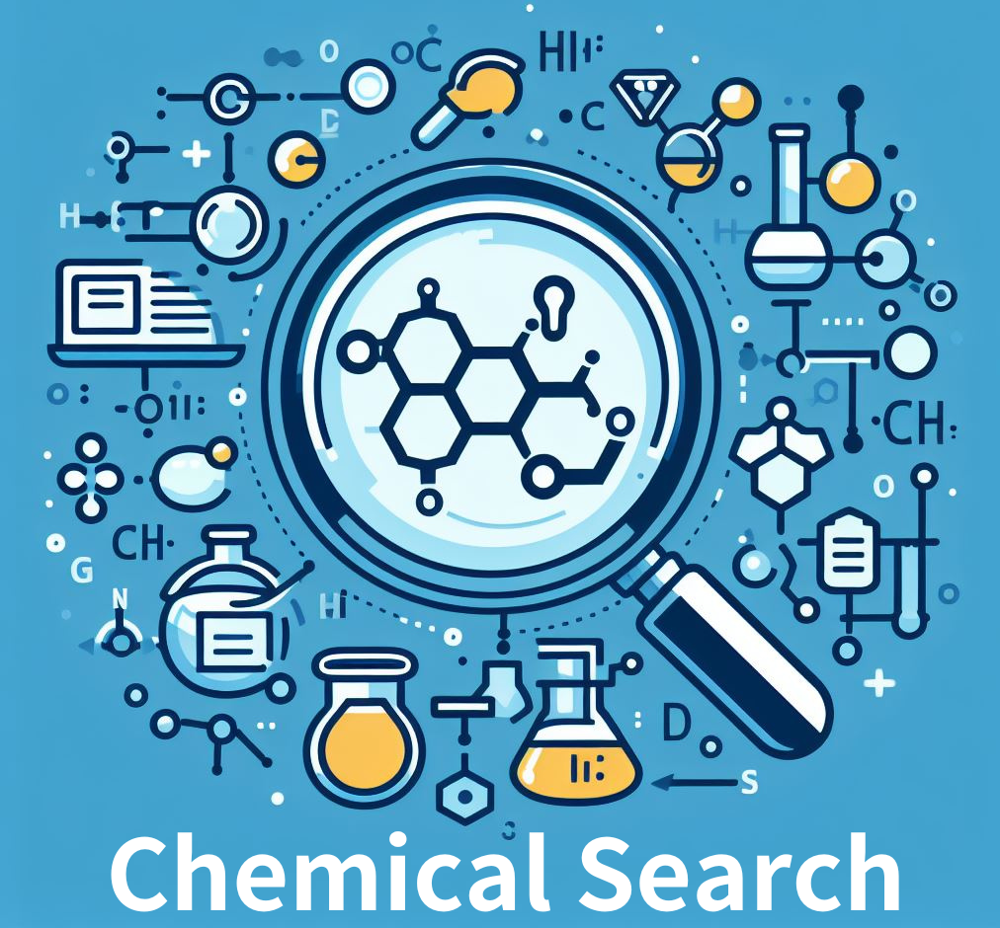

<!-- source: https://www.nagase.co.jp/color/ -->

+-------------------------------------+
| **Hero-Landing**                    |
+-------------------------------------+
|  |
|                                     |
| 色と機能で、新しい価値を創造・提案します。 |
|                                     |
| [機能色材部について](/color/about/) |
+-------------------------------------+

---

(style: pink-lighter)

## ピックアップ製品

+--------------------------------------------------------------+--------------------------------------------------------------+
| **Cards-Product**                                                                                                           |
+--------------------------------------------------------------+--------------------------------------------------------------+
| ### Special Effect Pigment（パール顔料）                     | ### Black Diamond®                                           |
|                                                              |                                                              |
| DIC株式会社（旧カラー＆エフェクト）                          | 赤穂化成株式会社                                             |
|                                                              |                                                              |
| 多種多様な高意匠性を生み出す光輝性顔料                       | かつてない黒の煌めきを追求した光輝性顔料                     |
|                                                              |                                                              |
| [詳細を見る](/color/products/pickup/basf-pearl/)            | [詳細を見る](/color/products/pickup/black-diamond/)          |
+--------------------------------------------------------------+--------------------------------------------------------------+
| ### Tinuvin® DW                                              | ### 非フッ素系耐油コーティング材                             |
|                                                              |                                                              |
| BASFジャパン株式会社                                         | 長瀬産業オリジナル開発品(環境対応型)                         |
|                                                              |                                                              |
| 水系インキ・コーティング材向け紫外線吸収剤・光安定剤         | 食品包装用の水系コーティング材                               |
|                                                              |                                                              |
| [詳細を見る](/color/products/pickup/tinuvin/)                | [詳細を見る](/color/products/pickup/coating/)                |
+--------------------------------------------------------------+--------------------------------------------------------------+

+------------------------------------------------+
| **Cards-Product**                              |
+------------------------------------------------+
| ### 顔料やフィラーなど「分散」でお悩みの方はこちら |
|                                                |
| 分散の受託先のご提案や、自社ラボを活用した処方の開発を行います |
|                                                |
| [分散について](/color/preparation/)            |
+------------------------------------------------+

+--------------------------------+
| **Cards-Product**              |
+--------------------------------+
| ### 商材紹介                   |
|                                |
| 機能色材部が取り扱う商材をご紹介します。 |
|                                |
| [商材紹介へ](/color/products/) |
+--------------------------------+

## 原材料から探す

+--------------------------------------+--------------------------------------+
| **Columns-Info**                                                            |
+--------------------------------------+--------------------------------------+
| ### 色材                             | ### 添加剤                           |
|                                      |                                      |
| 一般的な顔料や染料、機能性色素を取り揃えております。 | 紫外線吸収剤や酸化防止剤など、機能性添加剤を取り揃えております。 |
|                                      |                                      |
| [詳細を見る](/color/products/pigments/) | [詳細を見る](/color/products/additives/) |
+--------------------------------------+--------------------------------------+

+------------------------------+
| **Cards-Product**            |
+------------------------------+
| ### 用途                     |
|                              |
| インキ・塗料・プラスチックと、用途に応じてご確認いただけます。 |
|                              |
| [用途紹介へ](/color/use/)    |
+------------------------------+

---

## サービス紹介

+---------------------------------------+---------------------------------------+---------------------------------------+
| **Cards-Product**                                                                                                   |
+---------------------------------------+---------------------------------------+---------------------------------------+
| ### 分散加工技術                      | ### カラー工房活動                    | ### NAW（自社ラボ）                   |
|                                       |                                       |                                       |
| [詳細を見る](/color/service/#skill)   | [詳細を見る](/color/service/#activity) | [詳細を見る](/color/service/#naw)     |
+---------------------------------------+---------------------------------------+---------------------------------------+

機能色材部でご提供している3つの主なサービスについてご紹介します。

---

## お知らせ

- **2023年12月27日** [社）日本流行色協会　2024年を象徴する色を発表](/color/news/#202312)
- **2023年1月18日** [社）日本流行色協会　2023年を象徴する色を発表](/color/news/#202301)
- **2022年8月17日** [耐油性コーティング材の製品ページを公開しました。](/color/products/pickup/coating/)
- **2022年6月23日** [分散加工WEBサイトを公開しました。](/color/preparation/)
- **2021年12月9日** [Tinuvin DWの製品ページを公開しました。](/color/products/pickup/tinuvin/)
- **2021年1月12日** [社）日本流行色協会　2021年を象徴する色を発表](/color/news/#20210112)
- **2018年6月29日** WEBサイトのリニューアル・更新を行いました。
- **2017年2月20日** カラー&プロセシング事業部　機能色材部WEBサイトリニューアルしました
- **2016年11月16日** [いい色の日に　社）日本流行色協会　2016年・2017年を象徴する色を発表](/color/news/#20161116)

---

## サンプル請求・お問合せ

製品のサンプル請求または、お問合せについては、こちらよりお気軽にご連絡くださいませ。

[サンプル請求・お問合せ](/color/contact/)

---

+-----------------------------------------------+
| **Cards-Product**                             |
+-----------------------------------------------+
|  |
|                                               |
| 長瀬産業株式会社 カラー＆プロセシング事業部  |
| ポリマープロダクツ部のTRITAN™サイトへ移動します。 |
|                                               |
| [TRITAN™サイトへ](/pp/tritan/)               |
+-----------------------------------------------+
|  |
|                                               |
| 日本流行色協会のサイトへ移動します。          |
|                                               |
| [JAFCAサイトへ](https://www.jafca.org/)       |
+-----------------------------------------------+
|  |
|                                               |
| 塗料原料検索サービス Chemical Search          |
|                                               |
| [Chemical Searchへ](https://chemical-search.nagase.com/) |
+-----------------------------------------------+

---

+---------------------+-----------------------------------------------------------+
| **Metadata**                                                                    |
+---------------------+-----------------------------------------------------------+
| Title               | トップページ｜長瀬産業株式会社 機能化学品事業部 機能色材部 |
+---------------------+-----------------------------------------------------------+
| Description         | Description                                               |
+---------------------+-----------------------------------------------------------+
